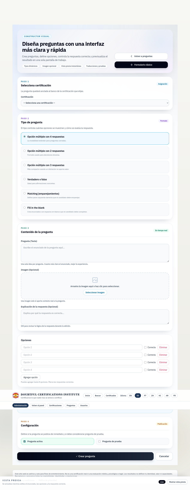

<div align="center">

# HHGG — Plataforma Satírica de Certificaciones

**Diseñada para hacer reír. Construida para impresionar.**

[](https://laravel.com)
[](https://php.net)
[](https://livewire.laravel.com)
[](https://mysql.com)
[](https://www.docker.com/)
[](https://hhgg-5c2f.onrender.com/)

[**Ver demo en vivo →**](https://hhgg-5c2f.onrender.com/)

</div>

---


---

## ¿Qué es HHGG?

HHGG es una plataforma de certificaciones completamente funcional con un giro satírico. Simula el ciclo de vida completo de un sistema de acreditación profesional — desde el registro del candidato hasta la emisión y verificación pública del certificado — construida sobre un stack PHP moderno con prácticas de ingeniería reales.

> La sátira es el producto. La ingeniería es el portafolio.

---

## ¿Por qué es interesante técnicamente?

| Área | Qué hay aquí |
|---|---|
| 🧠 **Motor de examen** | Preguntas aleatorizadas, scoring ponderado, modo sudden-death, cooldowns y control de intentos |
| 🏅 **Certificados verificables** | Serial único, hash SHA-256 y endpoint de verificación pública por certificado |
| 🌍 **Multiidioma real** | 7 locales (`en`, `es`, `pt`, `zh`, `hi`, `ar`, `fr`) con traducciones por pregunta y fallback automático |
| 📦 **Pipeline import/export** | Empaquetado completo en ZIP (`manifest.json` + `questions.csv` + assets), validado y despachado a cola |
| 🛠️ **Panel admin** | CRUD de certificaciones, constructor de preguntas, editor de plantillas HTML/CSS, snapshots, rollback y audit log |
| 🔁 **Sistema de versiones** | Snapshots inmutables en cada cambio, diff entre versiones, rollback con un clic |

---

## Stack

```
Backend   Laravel 11 · PHP 8.4
Frontend  Livewire 4 · Blade · Tailwind CSS · Vite · Alpine.js
Base de datos  MySQL 8 / PostgreSQL (configurable por entorno)
PDF       barryvdh/laravel-dompdf
Colas     Laravel Queue (sync / database / redis)
Cache     Redis (Upstash en producción)
Deploy    Docker · Nginx · PHP-FPM · Render
```

---

## Capturas

<div align="center">

| Panel admin | Constructor de preguntas |
|---|---|
|  |  |

| Wizard de certificación | Certificado emitido |
|---|---|
|  |  |

</div>

> Galería completa en [`documentation/images/`](./documentation/images/)

---

## Flujo de la plataforma

```
Catálogo → Registro → Examen → Resultado → Certificado → Verificación pública
```

**Rutas principales**

| Ruta | Función |
|---|---|
| `/` | Catálogo público con filtros y búsqueda |
| `/exam/{certType}/register` | Registro e identificación del candidato |
| `/exam/{certType}` | Motor de quiz en tiempo real |
| `/result/{serial}` | Resultado público por serial |
| `/cert/{serial}` | Vista pública del certificado |
| `/cert/{serial}/pdf` | Descarga del PDF generado |
| `/admin/*` | Panel de administración completo |

---

## Arranque local

```bash
cp .env.example .env
composer install
npm install
php artisan key:generate
php artisan migrate --seed
npm run dev
php artisan serve --host=0.0.0.0 --port=8000
```

Para Docker: ver `docker/` y `docker/start-container.sh`.

---

## Tests

```bash
composer test:unit    # Suite rápida, sin servicios externos
composer test:feature # Suite completa, requiere base de datos
```

---

## Documentación

| Documento | Qué cubre |
|---|---|
| [Guía de despliegue](./documentation/DEPLOY_RENDER_NEON_AIVEN.md) | Render + Neon/Aiven, variables de entorno, workflows CI/CD |
| [Guía del builder visual](./documentation/VISUAL_BUILDER_GUIDE.md) | Editor admin, panel de preguntas, UI de versiones |
| [Sistema de versionado](./documentation/VERSIONING_SYSTEM.md) | Snapshots, rollback, comparación de versiones |
| [Banco de preguntas](./documentation/QUESTION_BANK_CERTIFICATION_GUIDE.md) | Estructura del banco, contrato CSV, scoring, i18n |
| [Guía de ZIPs de cursos](./documentation/COURSE_ZIP_GUIDE.md) | Formato del paquete, contrato de importación/exportación |
| [Esquema questions.csv](./model/questions_csv_schema.md) | Especificación completa de columnas con layout multilenguaje |
| [Prompt de certificación](./model/CLAUDE_CERTIFICATION_PROMPT.md) | Prompt de IA para generar certificaciones completas |
| [Troubleshooting](./documentation/TROUBLESHOOTING.md) | Problemas conocidos, soluciones, checklist de debugging |

---

## Arquitectura del proyecto

```
app/
├── Enums/              QuestionType · SuddenDeathMode
├── Http/Controllers/
│   ├── Admin/          Certificaciones · Preguntas · Plantillas · Import/Export
│   └── Api/            Endpoints internos y webhooks
├── Models/             Certification · Question · Certificate · CertificationVersion
├── Observers/          CertificationObserver (versionado automático)
└── Support/            Servicios: scoring · versioning · ZIP import/export · CSV validation
database/
├── migrations/         Esquema completo + seeds de plantillas
└── seeders/
resources/views/
├── admin/              Panel admin con Blade + Livewire
└── pdf/                Plantillas de certificado para DOMPDF
```

---

<div align="center">

**HHGG no es una certificación real ni sustituye evaluaciones médicas, psicológicas o legales.**
Este repositorio existe para demostrar el alcance técnico, el producto y el mantenimiento de una aplicación Laravel moderna.

</div>
